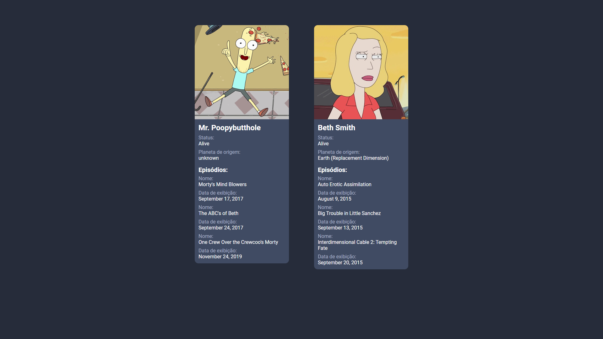

## Stack

- Python
- Flask

## Instalação

- clone esse repositório e execute o pip para instalar as dependências

        pip install -r requirements.txt

- para rodar o servidor

        flask run

- acesse http://localhost:5000

# Preview

